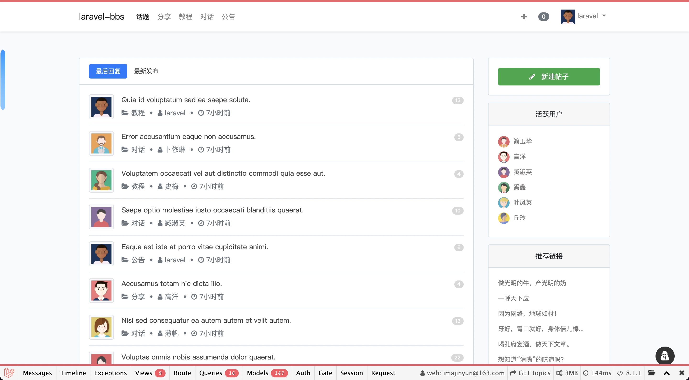

# 🌈 A small application of practice training based on laravel framework

[](https://www.codacy.com/gh/imajinyun/laravel-bbs/dashboard?utm_source=github.com&amp;utm_medium=referral&amp;utm_content=imajinyun/laravel-bbs&amp;utm_campaign=Badge_Grade)
[](https://www.php.net/supported-versions.php)


## Requirements

* PHP >= 8.0.0
* Laravel >= 9.0

## Installation

> This project requires PHP 8+ and Laravel 9.

```bash
// Clone source code.
$ git clone git@github.com:imajinyun/laravel-bbs.git

// Copy .env.development to .env, and fill in the relevant configuration values.
$ cd laravel-bbs && cp .env.development .env

// Install dependencies for application.
$ composer install

// To start Sail.
$ ./vendor/bin/sail up

// Enter laravel-bbs-app container.
$ docker exec -it laravel-bbs-app /bin/bash

// Execute migration command.
$ php artisan migrate --seed
```

## Screenshots



## About

## License

The Laravel BBS is open-source software licensed under the [MIT license](https://opensource.org/licenses/MIT).
